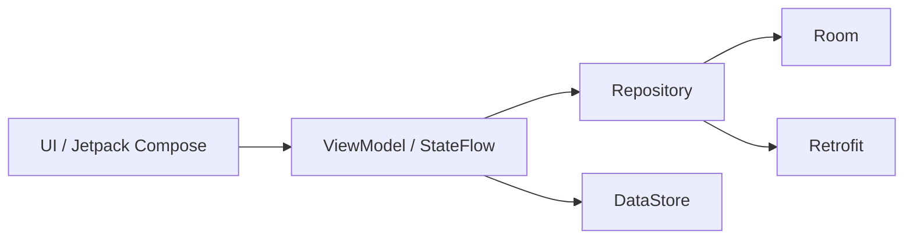
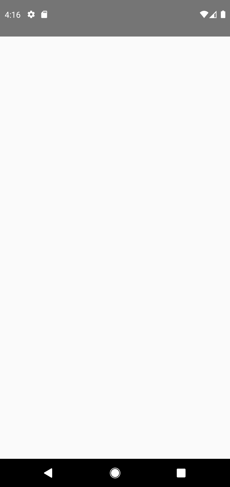
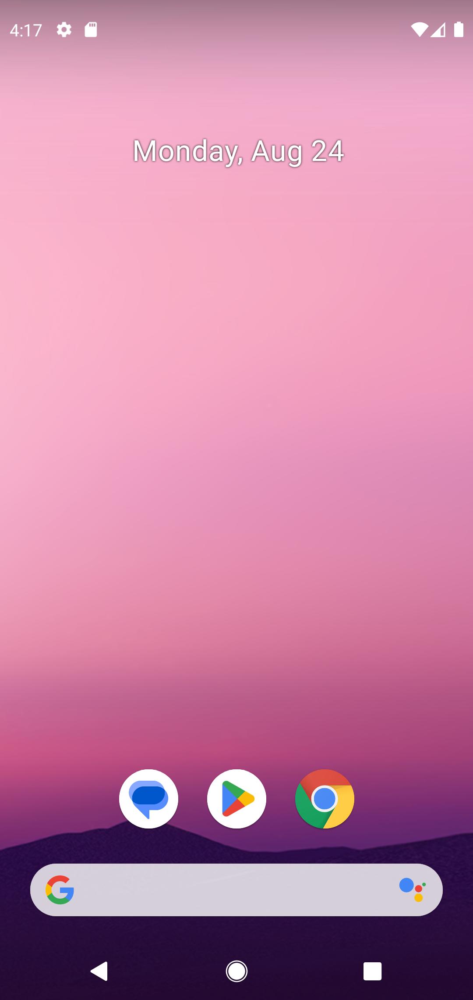
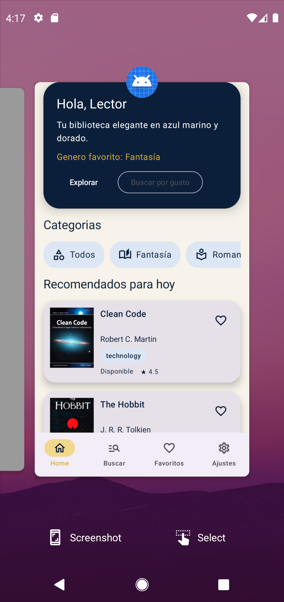

# BookLibrary

Aplicación Android de biblioteca y catálogo de libros desarrollada en Jetpack Compose con Material 3. La app cumple la estructura pedida en la actividad: navegación principal, pantalla de detalle con resumen y comentarios, favoritos persistidos, filtros, búsqueda, ajustes del usuario y diseño visual en azul marino + dorado.

## Descripción de la app

BookLibrary permite explorar libros, buscar por título, autor, categoría o ISBN, aplicar filtros combinables, guardar favoritos en local y personalizar la experiencia con tema oscuro y tamaño de fuente. La app está pensada para seguir funcionando en el emulador incluso cuando Google Books limite peticiones, gracias a un catálogo base local que se mezcla con la respuesta remota.

## Funcionalidades principales

- Navegación rápida con BottomNavigation: Home, Buscar, Favoritos, Ajustes.
- Pantalla principal con listado tipo LazyColumn de libros y portadas con Coil.
- Detalle del libro con texto descriptivo, información básica, foto, comentarios y botón de favorito.
- Favoritos persistidos en Room con tabla `favorites` (`bookId`, `title`, `cover`, `addedAt`).
- Búsqueda por título, autor, categoría y ISBN trabajando contra Google Books API.
- Filtros combinables por categoría, disponibilidad y valoración.
- Categorías visibles en pantalla principal y búsqueda.
- Configuración con modo claro/oscuro, tamaño de fuente y sesión activa/cerrada.
- Preferencias persistidas en DataStore.
- Diseño Material 3 con tema azul marino + dorado y tarjetas con sombra.

## Arquitectura

La aplicación está organizada por capas:

```text
ui (Jetpack Compose)
  -> viewmodel (StateFlow + viewModelScope.launch)
    -> repository
      -> data
        -> local (Room)
        -> remote (Retrofit + Google Books API)
```

### Diagrama de arquitectura



### Estructura clave

- `ui/navigation/AppNavigation.kt`: navegación principal.
- `ui/screens/home/HomeScreen.kt`: lista principal.
- `ui/screens/search/SearchScreen.kt`: búsqueda, filtros y categorías.
- `ui/screens/detail/BookDetailScreen.kt`: detalle con comentarios y foto.
- `ui/screens/favorites/FavoritesScreen.kt`: libros guardados.
- `ui/screens/settings/SettingsScreen.kt`: modo oscuro, fuente y sesión.
- `ui/viewmodel/*`: lógica del estado en ViewModel.
- `data/repository/BookRepositoryImpl.kt`: unión de datos locales y remotos.
- `preferences/UserPreferences.kt`: configuración persistida.

## Persistencia

### Room

La entidad de favoritos guarda:

- `bookId`
- `title`
- `cover`
- `addedAt`

### DataStore

Se guardan estas preferencias:

- `dark_theme`
- `font_scale`
- `favorite_genre`
- `user_name`
- `session_active`

## API remota

Se consulta la API pública de Google Books:

```text
https://www.googleapis.com/books/v1/volumes?q=
```

Con manejo de estados:

- Loading
- Success
- Error

Además, la app incorpora un catálogo base local para que la búsqueda y los filtros sigan siendo utilizables cuando la API remota no devuelva datos o aplique rate limiting.

## Capturas de pantalla

### Home



### Buscar



### Favoritos


### Ajustes



## Requisitos del proyecto

- Android Studio con soporte para Compose
- JDK 17
- SDK Android 36
- mínimo API 24

## Ejecución en emulador

1. Abre el proyecto en Android Studio.
2. Espera a que sincronice Gradle.
3. Selecciona un emulador disponible o conecta un dispositivo.
4. Ejecuta la app desde Run > Run 'app'.

## Generar APK de prueba

Desde la raíz del proyecto:

```bash
./gradlew assembleDebug
```

El APK se genera en:

```text
app/build/outputs/apk/debug/app-debug.apk
```

## Generar AAB firmado

1. Crea un archivo `keystore.properties` en la raíz del proyecto.
2. Configura:

```properties
storeFile=keystore/booklibrary-release.jks
storePassword=TU_STORE_PASSWORD
keyAlias=booklibrary
keyPassword=TU_KEY_PASSWORD
```

3. Ejecuta:

```bash
./gradlew bundleRelease
```

Salida esperada:

```text
app/build/outputs/bundle/release/app-release.aab
```

> En este entorno la generación final del APK puede verse bloqueada por límites de memoria de la máquina (OOM en D8/R8), pero el proyecto queda preparado y la lógica de la app está implementada para ser probada en emulador con recursos suficientes.

## Archivos de instalación

- APK debug directo: `app/build/outputs/apk/debug/app-debug.apk`
- AAB release firmado: `app/build/outputs/bundle/release/app-release.aab`

## Permisos

- `INTERNET` para consultar Google Books.
- `CAMERA` para apoyo de búsqueda por ISBN, con manejo de denegación y alternativa manual.

## Estructura general

```text
app/src/main/java/com/tustockpro/booklibrary/
├── data/
├── domain/
├── preferences/
├── ui/
│   ├── components/
│   ├── navigation/
│   ├── screens/
│   └── viewmodel/
├── BookLibraryApplication.kt
├── MainActivity.kt
└── README.md
```
